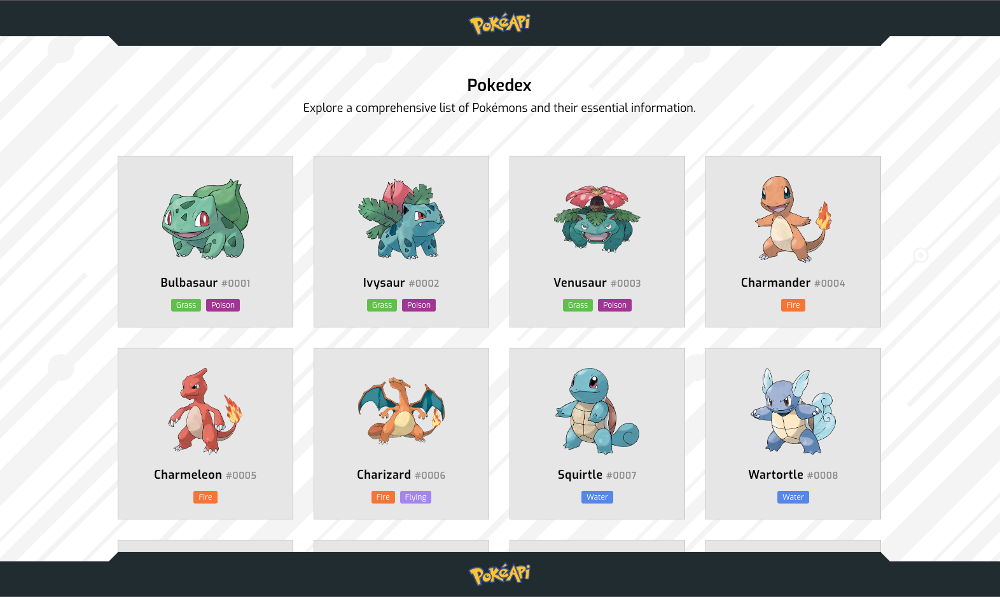

# Pokedex app

This app is a simple VanillaJS web app that displays a list of pokemons from an the open source api Pokeapi (https://pokeapi.co/)



## Table of contents

- [Requirements](#requirements)
- [Getting started](#getting-started)
- [Test](#tests)
- [Technologies and Dependencies](#technologies-and-dependencies)
- [Structure](#structure)
- [How it works](#how-it-works)

## Requirements
To view the app and to run tests you need to have **node** installed, I recommended to intall [Volta](https://volta.sh/) in order to run the same node version required by this app.

The node version used by this project is: `node@18.17.1`
## Getting started
Follow these instructions to run the application.

If you want to view the app on your local machine:

```bash
# Install dependencies
npm install

# Generate the preview of the app
npm run preview
```

If you want to start the development server:

```bash
npm run dev
```

Compile code:

```bash
npm run build
```

## Test
This app is tested with unit, integration and e2e tests.

Unit and Integration tests uses [Jest](https://jestjs.io/), while [Cypress](https://www.cypress.io/) is used for e2e ones.

To run all the tests (unit, integration, e2e):
```bash
npm run test:all
```
To run specific tests
```bash
npm run test:unit
npm run test:integration
npm run test:e2e
```


## Technologies and Dependencies
- Typescript (for type checking)
- Vitejs (for development environment and building)
- typescript-eslint (for linting)
- sass (as a css pre-processor)
- Jest (unit and integration tests)
- Cypress (e2e tests)

This project is written in VanillaJS and does not use any other third-party library or framework in order to work.

## Structure
Here is an overview of the structure of the application:

- **/cypress**: contains specifics to run e2e tests.
- **/public**: contains static assets like favicons and images used in the app.
- **/src/tests**: contains the unit and integration tests.
- **/src/assets/scss**: contains the scss of the application (this is compiled in css by Vite).
- **/src/assets/js/**: Contains the logic of the application, in detail:
  - **/components**: Contains individual UI components that can be reused throughout the application.
  - **/store**: Manages the state of the application.
  - **/api**: Houses functions and methods related to API calls.
  - **/utils**: Consists of utility functions that provide general-purpose tools for the app.
  - **/types**: Contains TypeScript type definitions used by the app.
  - **/services**: Includes the IntersectionObserver service.

## How it works
A brief description of the logic behind this app is as follows:

- Launching the app will start an API request to retrieve a list of 100 Pokemons from the pokeapi service.
- If there are errors with the request the app will render a message to notify the user.
- The response will return a list of pokemons with only few details (name, url).
- We initially render 100 cards populated with the only data available and a skeleton which indicates to the user that we will soon show more data.
- In order to display more data, we need to fetch the url returned by the first api call, but we don't want to run 100 request at the same time for performance reasons and api rate limit.
- We use the IntersercionObserver API to know which are the visible pokemons to the user and fetch only the urls of the visible pokemons.
- We then gradually populate the visible pokemons (based on user scroll) with some of the data received from the api request done by the IntersectionObserver.
- If there are errors while fetching a single pokemon, the user will be notified by the card being showed with an error message.
- A User can then click on a single Pokemon to open a Modal with additional Pokemon data.
- This will NOT trigger another api call because we use the data that we have already fetched previously with the IntersercionObserver.
- The modal can then be closed by clicking the close button or by clicking outside the modal content.
